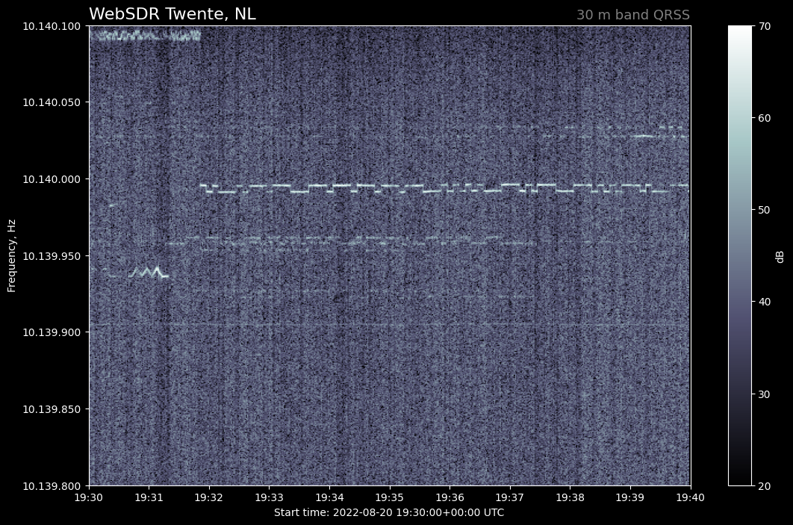

# WebSDRgrab
WebSDR QRSS Grabber, grabs QRSS frames from WebSDR servers.

Work in progress ...



## Local build, run, test
```
docker-compose build
docker-compose up -d
docker-compose logs -f websdrgrab
```
